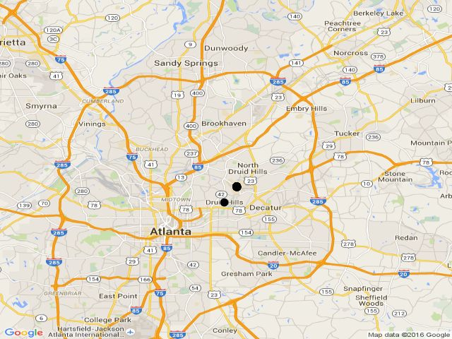

```{r, echo=FALSE}
library(knitr)
library(pander)
interventions <- read.csv('interventions.csv')

center_text <- function(text) {
  cat("<div style='text-align: center'>")
  cat(text)
  cat("</div>")

}
```


---
title: "SaniPath Exposure Assessment Report"
author: "Yuke Wang"
date: '`r format(Sys.time(), "%d %B, %Y")`'
output:
  html_document: null
  pdf_document: default
  toc: yes
---
# Introduction
Nullam sed felis pulvinar, commodo eros non, fermentum lectus. Pellentesque finibus sapien tincidunt enim porttitor dictum. Quisque porta orci non sapien ornare, ut feugiat magna laoreet. Interdum et malesuada fames ac ante ipsum primis in faucibus. Mauris at leo eget nisi dictum ultrices. Cum sociis natoque penatibus et magnis dis parturient montes, nascetur ridiculus mus. Nulla facilisi. Quisque feugiat mauris dapibus porta vulputate. Vivamus et bibendum arcu, at consectetur ex. Proin mauris justo, pulvinar sed ultricies in, maximus ac quam. Vestibulum id lacinia magna. Fusce id sapien sed nisi viverra fermentum a a risus. Nunc sit amet nisl pellentesque massa finibus pellentesque at id sapien.


# Methods
Lorem ipsum dolor sit amet, consectetur adipiscing elit. Suspendisse a tortor ex. Integer justo sem, gravida quis ante vel, luctus iaculis ante. Nam rhoncus diam sed risus dignissim dignissim. Pellentesque condimentum augue nec mauris laoreet fringilla. Vivamus sapien mi, eleifend ultrices nulla in, lacinia pellentesque nibh. Donec ante odio, semper eget dolor tempor, tristique interdum nunc. Curabitur vitae nunc sed lectus euismod tempor a ac augue. Nam semper turpis quis ullamcorper tempus. Vivamus eget nisl mattis, imperdiet nibh a, blandit mi. Maecenas vestibulum dictum nisi, et malesuada purus. Ut sed orci sem.

```{r, results='asis', echo=F}
center_text(paste0('#### Figure 1: Map of Neighborhoods Surveyed\n'))
```


```{r, echo=F, results='asis'}
  cat('<div style="text-align: center">')
   suppressWarnings(create_surveyMap(household_data, school_data, community_data, collection_data))
  # cat('')
   cat('</div>')

```


```{r, echo=F, results='asis'}
   
center_text('#### Table 1: Surveys Collected\n')
tbl <- data.frame(matrix(nrow=2, ncol=0))
d <- list(household_data, school_data, community_data, collection_data)
names(d) <- c('Household', 'School', 'Community', 'Collection')
for (i in d) {
  tbl <- cbind(tbl, as.vector(table(i$neighbor)))
}

colnames(tbl) <- names(d)
rownames(tbl) <- paste('Neighborhood', 1:nrow(tbl))
pandoc.table(tbl, format='markdown')

```


# Results
Significant findings.  Lorem ipsum dolor sit amet, consectetur adipiscing elit. Nunc non libero vitae nisl pharetra egestas. Aliquam venenatis tellus quis ligula suscipit feugiat. Vivamus eget tincidunt odio. Proin et quam ac velit aliquet blandit a a nunc. Nam id tempor ante. Nunc vel ullamcorper nisl. Phasellus eget ligula sit amet mi mattis blandit. Mauris pharetra varius eros, accumsan rhoncus nisi rutrum at. Suspendisse non leo metus. Integer urna lorem, efficitur ut posuere eget, interdum ut quam. Fusce maximus sodales risus eget laoreet.

Praesent erat tortor, ullamcorper id ante pellentesque, imperdiet sodales felis. Ut nec molestie enim. Aenean elementum, sem vel hendrerit volutpat, augue erat gravida tellus, a dapibus felis enim sed neque. Etiam dolor ex, malesuada non elit nec, consectetur efficitur metus. Integer ultrices arcu lacinia, ultrices orci id, maximus mi. Pellentesque vel est non mauris congue mattis ut eu nisi. Integer venenatis metus risus, ac auctor elit pellentesque vel.


```{r, echo=FALSE, results='asis', message=FALSE}
fig <- 2
tab <- 2
for (n in 1:length(report())) { # each neighborhood
  neighb_lab <- names(report()[n])
  center_text(paste("### --", neighb_lab,"--\n")) # print the neighborhood name

  for (a in 1:length(report()[[n]])) { # each age
    age_lab <- names(report()[[n]][a])
    cat("#### ", paste0("*",age_lab,"*"), "\n") # print age name
    sub <- report()[[n]][[a]]
    
    ## make the plots ---------------------------------------------------
    fname = paste0('temp/pplplot',sub$max_dominant$neighborhood, sub$max_dominant$age,sub$max_dominant$sample, '.png')
    fname = gsub(" ", "", fname)
    png(filename= fname, height = 480, width = 270)
       
      PS_Plot(paste0("Figure ", fig,": \n",sub$max_dominant$neighborhood,", ", sub$max_dominant$age , ', \n',sub$max_dominant$sample), 
             sub$max_dominant$n, sub$max_dominant$dose)
      
    dev.off()

    fig <- fig + 1
    
    freq_vector <- (sub$max_dominant$data - 4) * -1
    
    fname_pie <- gsub('pplplot','pie',fname)
    
    png(filename= fname_pie, height= 430, width= 450)
    suppressWarnings(
      print(
        create_pieChart(freq_vector, sub$max_dominant$sample, 
                    paste0("Figure ", fig,": \n",sub$max_dominant$neighborhood,", ", 
                           sub$max_dominant$age , ', \n',sub$max_dominant$sample)
                        )
            )
    )
    dev.off()
    
    cat(paste0('The most dominant pathway identified is ', sub$max_dominant$sample,"."))
    center_text(paste0(''," ", paste0('','\n\n')))
    
    # make the summary sentence
    verb <- 'are'
    if (length(sub$dominant) > 2) {
        dominant <- paste(sub$dominant[1:(length(sub$dominant) - 1)], collapse=", ")
        dominant <- paste0(dominant, ', and ', sub$dominant[length(sub$dominant)])
    }
    else if (length(sub$dominant) == 2) {
      dominant <- paste(sub$dominant, collapse=' and ')
    }
    else {
      dominant <- sub$dominant
      verb <- 'is'
    }
    # print the table
    center_text(paste('####',paste0('Table ',tab,": ", neighb_lab, ", ", age_lab),"Identified Pathways\n"))
    pandoc.table(sub$matrix, format='markdown')
    cat("\\* Dominant Pathway \n\n")
    cat(paste0("The dominant pathways identified ", verb," ", dominant, ".\n\n\n"))

    fig <- fig + 1
    tab <- tab + 1
  }
}
```

# Interpretation
Behavioral factors that may have contributed to the results. Ut luctus dignissim sodales. Suspendisse bibendum orci lorem, at ullamcorper libero ullamcorper vel. Fusce non orci nunc. Curabitur sed fermentum est. Suspendisse at ipsum mollis, eleifend eros non, eleifend felis. Nulla facilisi. Donec vulputate iaculis aliquet. Vestibulum vitae auctor felis, sed accumsan arcu.

```{r, echo=FALSE, results='asis'}
for (n in 1:length(report())) { # each neighborhood
  cat("###", names(report()[n]),"\n") # print the neighborhood name
  for (a in 1:length(report()[[n]])) { # each age
    cat("####", names(report()[[n]][a]), "\n") # print age name
    sub <- report()[[n]][[a]]$pathway_table
    
    sub$high_dose <- suppressWarnings(revalue(as.character(sub$high_dose), c('0' = 'Low', '1' = 'High')))
    sub$freq <- suppressWarnings(revalue(as.character(sub$freq), c('0' = 'Low', '1' = 'High')))
    
    ints <- interventions[interventions$pathway %in% sub$pathway[sub$dominant == 1] &
                            interventions$dose %in% sub$high_dose[sub$dominant == 1] &
                            interventions$frequency %in% sub$freq[sub$dominant == 1] &
                            interventions$dominant == "Dominant",]
    ints <- apply(ints, 2, as.character)
    
    for (int in 1:nrow(ints)) {
      cat(ints[int, 'suggested_intervention'], '\n\n')
    }
    
  }
}
```
